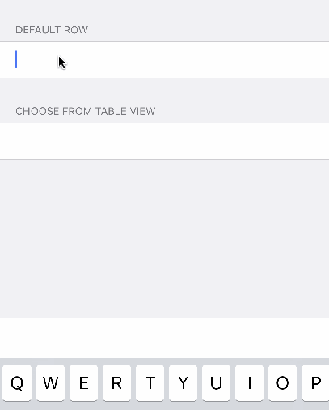

<p align="left">
<!--<a href="https://travis-ci.org/EurekaCommunity/GooglePlacesRow"></a>-->

<a href="https://developer.apple.com/swift"></a>
<a href="https://cocoapods.org/pods/GooglePlacesRow"></a>
<a href="https://raw.githubusercontent.com/EurekaCommunity/GooglePlacesRow/master/LICENSE"></a>
</p>

By [Xmartlabs SRL](http://EurekaCommunity.com).

**Current Google Places version used is 3.3**

Swift 5 is supported from version 3.2

## Contents

* [Introduction](#introduction)
* [Installation](#installation)
* [Usage](#usage)
* [Dependencies](#dependencies)
* [Requirements](#requirements)
* [Getting involved](#getting-involved)
* [Examples](#examples)
* [Customization](#customization)
* [FAQ](#faq)

## Introduction

GooglePlacesRow is a row extension for Eureka. It implements a row where the user can use Google Places autocomplete functionality to select a place suggested by the API.

GooglePlacesRow includes two rows with similar functionality but their options are displayed differently:
* GooglePlacesAccessoryRow: displays a collection view as the `inputAccessoryView` of the cell. The user will be able to scroll horizontally to select the desired place
* GooglePlacesTableRow: displays a `UITableView` directly below the cell for the user to choose the desired option.

The project is experimental and open to changes although it is already quite customizable.

 

## Installation

#### CocoaPods

[CocoaPods](https://cocoapods.org/) is a dependency manager for Cocoa projects.

To install GooglePlacesRow, simply add the following line to your Podfile:

```ruby
pod 'GooglePlacesRow'
```

This will also install Eureka and GooglePlaces.

> Note: Do not add `pod 'GooglePlaces'` to your podfile as this library includes it as a vendor framework

<!--#### Carthage

[Carthage](https://github.com/Carthage/Carthage) is a simple, decentralized dependency manager for Cocoa.

To install GooglePlacesRow, simply add the following line to your Cartfile:

```ogdl
github "EurekaCommunity/GooglePlacesRow"
```-->

## Usage

### How to get API key
1. Navigate to [https://console.developers.google.com/](https://console.developers.google.com/)
2. Create a new project (or choose existing one)
3. Enable _Google Places API for iOS_
4. Copy the key and paste in `AppDelegate.swift`

### How to use GooglePlacesRow

1. First, navigate to `AppDelegate.swift` and add `import GooglePlaces` on top.

	```swift
	// AppDelegate.swift
	import GooglePlaces
	```

2. In method `didFinishLaunchingWithOptions` add this code before `return` keyword.

	```swift
	// AppDelegate.swift, application:didFinishLaunchingWithOptions
	let apiKey = "YOUR_API_KEY"
	GMSPlacesClient.provideAPIKey(apiKey)
	```
3. Subclass your `ViewController` with `FormViewController`

	```swift
	class YourViewController: FormViewController {
	    override func viewDidLoad() {
	        super.viewDidLoad()
			// Code for setting up Eureka goes here
	    }
	}
	```

2. Use it in your Eureka form, as you would any other Eureka row.

    ```swift
    // in your controller, in viewDidLoad()
    form +++ Section("Choose from table view")
        <<< GooglePlacesTableRow() { row in
		        row.title = "Location" // Adds a title to a row
		        row.tag = "location" // Upon parsing a form you get a nice key if you use a tag
		        row.add(ruleSet: RuleSet<GooglePlace>()) // We can use GooglePlace() as a rule
		        row.validationOptions = .validatesOnChangeAfterBlurred
		        row.cell.textLabel?.textColor = UIColor.black
			}
			.cellUpdate { cell, row in // Optional
		        // Do something when cell updates
			}

	    +++ Section("Customized cell, customized layout")
	        <<< GooglePlacesAccessoryRow().cellSetup { cell, row in
	            (cell.collectionViewLayout  as? UICollectionViewFlowLayout)?.sectionInset = UIEdgeInsets.zero
	            (cell.collectionViewLayout  as? UICollectionViewFlowLayout)?.minimumInteritemSpacing = 40
	            cell.customizeCollectionViewCell = { customCell in
	                customCell.label.textColor = UIColor.red
	                customCell.layer.borderColor = UIColor.green.cgColor
	                customCell.layer.borderWidth = 1
	                customCell.layer.cornerRadius = 4
	            }
	        }
    ```
To see what you can customize have a look at the [Customization](#customization) section or the [FAQ](#faq)

## Dependencies
* Eureka
* GooglePlaces (and all the frameworks it depends on)
* GoogleMapsBase

> Note: You only need to add `pod 'GooglePlacesRow'` to your podfile and other pods will be installed automatically

## Requirements

* iOS 9.3+
* Xcode 10.2+

## Getting involved

* If you **want to contribute** please feel free to **submit pull requests**.
* If you **have a feature request** please **open an issue**.
* If you **found a bug** or **need help** please **check older issues or the [FAQ](#faq) before submitting an issue.**.

Before contributing check the [CONTRIBUTING](https://github.com/EurekaCommunity/GooglePlacesRow/blob/master/CONTRIBUTING.md) file for more info.

If you use **GooglePlacesRow** in your app we would love to hear about it! Drop us a line on [twitter](https://twitter.com/EurekaCommunity).

## Examples

Follow these steps to run Example project:
* Clone GooglePlacesRow repository
* Execute `git submodule add https://github.com/xmartlabs/Eureka.git` in the cloned folder.
* Open GooglePlacesRow workspace
* **Set your Google places API KEY in `AppDelegate.swift`**
* and run the *Example* project.


## Customization

### General customization
There are five variables that you can use to modify the default behavior of these rows:

* In the row:
	* `placeFilter`: Is a `GMSAutocompleteFilter` used in the request to Google Places to define what kind of suggestions will be returned (e.g. cities, addresses, country). Refer to the official documentation of Google for more detailed information.
	* `placeBounds`: Bounds to limit the search for places. Refer to the official documentation of Google for more detailed information.
	* `onNetworkingError`: Block that is called when the request to Google Places returns an error
* In the cell:
	* `useTimer`: If the request to Google Places should be throttled using a timer. If `true` then it will wait for `timerInterval` seconds before making a request. If the user continues entering text into the row then the previous request will not be fired
	* `timerInterval`: The interval in seconds used for the timer explained above

### GooglePlacesAccessoryRow
GooglePlacesAccessoryRow uses a generic `GooglePlacesCollectionCell` cell whose generic parameter is the UICollectionViewCell class used in the inputAccessoryView.

* If you just want to change minor things of the cell (you most probably will want to) then the `customizeCollectionViewCell` callback is for you. This block is called in the delegates `collectionView:cellForItemAtIndexPath:` method.

* If you want to change the **layout of the collectionView** then you can use/modify/override the `collectionViewLayout` attribute in the `cellSetup` method when declaring the row. Have a look at the examples for this.

* If you want to change something about the **collectionView** (e.g. its height, backgroundColor) then you can also do that in the `cellSetup` method. Have a look at the examples for this.

* If you want to **change the collection view cell of the inputAccessoryView** drastically then there is nothing easier than creating your own row (`MyGooglePlacesAccessoryRow`) with your own `MyCollectionViewCell`:
```swift
public final class MyGooglePlacesAccessoryRow: _GooglePlacesRow<GooglePlacesCollectionCell<MyCollectionViewCell>>, RowType {
    required public init(tag: String?) {
        super.init(tag: tag)
    }
}
```
In this case just make sure your cell conforms to `EurekaGooglePlacesCollectionViewCell`

### GooglePlacesTableRow
GooglePlacesTableRow uses a generic `GooglePlacesTableCell` cell whose generic parameter is the UITableViewCell class used to create the cells displayed in a UITableView with the suggested options from Google Places.

* If you just want to change minor things of the cells that display the options (you will most probably want to) then the `customizeTableViewCell` callback is for you. This block is called in the delegates `tableView:cellForRowAtIndexPath:` method.

* You can customize attributes of the `tableView` that is displayed with the options. You should do this in `cellSetup` and keep in mind that the frame of the tableView is reset each time the tableView is displayed.

* If you want to change these cells drastically then there is nothing easier than creating your own row (`MyGooglePlacesAccessoryRow`) with your own `MyCollectionViewCell`:
```swift
public final class MyGooglePlacesAccessoryRow: _GooglePlacesRow<GooglePlacesCollectionCell<MyCollectionViewCell>>, RowType {
    required public init(tag: String?) {
        super.init(tag: tag)
    }
}
```
In this case just make sure your cell conforms to `EurekaGooglePlacesTableViewCell`

## FAQ

#### Xcode says `ld: framework not found GoogleMaps for architecture x86_64`.

This is most probably because you forgot to tell Xcode where `GoogleMapsBase.framework` or `GooglePlaces.framework` is or you did forget to download it altogether. Please follow the [example instructions](#examples) or the [installation instructions](#installation).

#### How to use the value from GooglePlacesRow?

The value of a `GooglePlacesRow` is a `GooglePlace` which is an enum.

```swift
public enum GooglePlace {
    case userInput(value: String)
    case prediction(prediction: GMSAutocompletePrediction)
}
```

You can use `switch` to access the value:

```swift
switch row.value {
    case .userInput(let value):  
        print(value)  
    case .prediction(let prediction):  
        print(prediction.attributedPrimaryText)  
        print(prediction.attributedSecondaryText)  
        print(prediction.placeID)  
}
```

## Future work
* Carthage compatibility
* Investigate automation of the installation process


## Author

* [Mathias Claassen](https://github.com/mats-claassen) ([@mClaassen26](https://twitter.com/mClaassen26)) ([@EurekaCommunity](https://twitter.com/EurekaCommunity))

# Change Log

This can be found in the [CHANGELOG.md](CHANGELOG.md) file.
